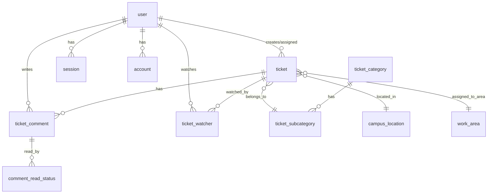

# Database Schema Documentation

## Tablas del Sistema

### Autenticación (Better Auth)

#### `user`
Usuarios del sistema con autenticación de Google.

| Campo | Tipo | Descripción |
|-------|------|-------------|
| id | text | ID único del usuario (PK) |
| name | text | Nombre completo |
| email | text | Email único |
| email_verified | boolean | Email verificado |
| image | text | URL de imagen de perfil |
| role | text | Rol: 'user' o 'admin' |
| is_active | boolean | Usuario activo/inactivo |
| deactivated_at | timestamp | Fecha de desactivación |
| deactivated_by | text | ID de quien desactivó (FK) |
| created_at | timestamp | Fecha de creación |
| updated_at | timestamp | Última actualización |

**Índices**:
- PK: `id`
- UNIQUE: `email`

#### `session`
Sesiones activas de usuarios.

| Campo | Tipo | Descripción |
|-------|------|-------------|
| id | text | ID de sesión (PK) |
| token | text | Token único |
| user_id | text | ID del usuario (FK) |
| expires_at | timestamp | Expiración |
| ip_address | text | IP del cliente |
| user_agent | text | User agent |
| created_at | timestamp | Creación |
| updated_at | timestamp | Actualización |

**Relaciones**:
- `user_id` → `user.id`

#### `account`
Cuentas OAuth vinculadas.

| Campo | Tipo | Descripción |
|-------|------|-------------|
| id | text | ID de cuenta (PK) |
| account_id | text | ID del proveedor |
| provider_id | text | Proveedor (google) |
| user_id | text | ID del usuario (FK) |
| access_token | text | Token de acceso |
| refresh_token | text | Token de refresco |
| expires_at | timestamp | Expiración |
| created_at | timestamp | Creación |
| updated_at | timestamp | Actualización |

**Relaciones**:
- `user_id` → `user.id`

---

### Gestión de Tickets

#### `ticket`
Tickets del sistema.

| Campo | Tipo | Descripción |
|-------|------|-------------|
| id | serial | ID único (PK) |
| ticket_code | text | Código TICKET-XXXX (único) |
| title | text | Título del ticket |
| description | text | Descripción detallada |
| subcategory_id | integer | Subcategoría (FK) |
| area_id | integer | Área de trabajo (FK) |
| campus_id | integer | Campus (FK) |
| priority | text | 'low', 'medium', 'high' |
| status | text | 'open', 'in_progress', 'resolved', 'closed' |
| created_by | text | Usuario creador (FK) |
| assigned_to | text | Usuario asignado (FK) |
| created_at | timestamp | Fecha creación |
| updated_at | timestamp | Última actualización |
| resolved_at | timestamp | Fecha resolución |
| closed_at | timestamp | Fecha cierre |

**Índices**:
- PK: `id`
- UNIQUE: `ticket_code`

**Relaciones**:
- `created_by` → `user.id`
- `assigned_to` → `user.id`
- `subcategory_id` → `ticket_subcategory.id`
- `area_id` → `work_area.id`
- `campus_id` → `campus_location.id`

#### `ticket_comment`
Comentarios en tickets.

| Campo | Tipo | Descripción |
|-------|------|-------------|
| id | serial | ID único (PK) |
| ticket_id | integer | ID del ticket (FK) |
| user_id | text | Autor (FK) |
| content | text | Contenido HTML |
| is_internal | boolean | Comentario interno |
| created_at | timestamp | Fecha creación |
| updated_at | timestamp | Última edición |

**Relaciones**:
- `ticket_id` → `ticket.id` (CASCADE)
- `user_id` → `user.id`

#### `ticket_watcher`
Usuarios observando tickets.

| Campo | Tipo | Descripción |
|-------|------|-------------|
| ticket_id | integer | ID del ticket (FK) |
| user_id | text | ID del usuario (FK) |
| added_at | timestamp | Fecha agregado |

**Índices**:
- PK compuesta: `(ticket_id, user_id)`

**Relaciones**:
- `ticket_id` → `ticket.id` (CASCADE)
- `user_id` → `user.id` (CASCADE)

#### `comment_read_status`
Estado de lectura de comentarios.

| Campo | Tipo | Descripción |
|-------|------|-------------|
| comment_id | integer | ID del comentario (FK) |
| user_id | text | ID del usuario (FK) |
| read_at | timestamp | Fecha de lectura |

**Índices**:
- PK compuesta: `(comment_id, user_id)`

**Relaciones**:
- `comment_id` → `ticket_comment.id` (CASCADE)
- `user_id` → `user.id` (CASCADE)

---

### Configuración

#### `ticket_category`
Categorías principales de tickets.

| Campo | Tipo | Descripción |
|-------|------|-------------|
| id | serial | ID único (PK) |
| name | text | Nombre de categoría (único) |
| description | text | Descripción |
| display_order | integer | Orden de visualización |
| is_active | boolean | Activa/inactiva |
| created_at | timestamp | Creación |
| updated_at | timestamp | Actualización |

**Índices**:
- PK: `id`
- UNIQUE: `name`

#### `ticket_subcategory`
Subcategorías de tickets.

| Campo | Tipo | Descripción |
|-------|------|-------------|
| id | serial | ID único (PK) |
| category_id | integer | Categoría padre (FK) |
| name | text | Nombre |
| description | text | Descripción |
| display_order | integer | Orden dentro de categoría |
| is_active | boolean | Activa/inactiva |
| created_at | timestamp | Creación |
| updated_at | timestamp | Actualización |

**Índices**:
- PK: `id`
- UNIQUE: `(category_id, name)`

**Relaciones**:
- `category_id` → `ticket_category.id`

#### `campus_location`
Locations físicas/campus.

| Campo | Tipo | Descripción |
|-------|------|-------------|
| id | serial | ID único (PK) |
| name | text | Nombre del campus (único) |
| code | text | Código corto |
| is_active | boolean | Activo/inactivo |
| created_at | timestamp | Creación |
| updated_at | timestamp | Actualización |

**Índices**:
- PK: `id`
- UNIQUE: `name`

#### `work_area`
Áreas de trabajo.

| Campo | Tipo | Descripción |
|-------|------|-------------|
| id | serial | ID único (PK) |
| name | text | Nombre del área (único) |
| is_active | boolean | Activa/inactiva |
| created_at | timestamp | Creación |
| updated_at | timestamp | Actualización |

**Índices**:
- PK: `id`
- UNIQUE: `name`

#### `app_settings`
Configuraciones del sistema.

| Campo | Tipo | Descripción |
|-------|------|-------------|
| key | text | Clave de configuración (PK) |
| value | text | Valor |
| updated_at | timestamp | Última actualización |

**Configuraciones actuales**:
- `allow_new_tickets`: "true" o "false"
- `ticket_disabled_message`: Mensaje personalizado

---

## Relaciones del Sistema

### Diagrama de Relaciones



---

## Comandos Útiles

### Migraciones

```bash
# Generar nueva migración desde schema.ts
pnpm db:generate

# Aplicar migraciones pendientes
pnpm db:migrate

# Push directo (solo desarrollo)
pnpm db:push

# Ver estado de migraciones
pnpm drizzle-kit check
```

### Drizzle Studio

```bash
# Abrir interfaz visual
pnpm db:studio
```

Accede a `https://local.drizzle.studio`

### Consultas Comunes

#### Ver todos los tickets abiertos
```sql
SELECT 
    t.ticket_code,
    t.title,
    u.name as created_by_name,
    t.status,
    t.created_at
FROM ticket t
LEFT JOIN "user" u ON t.created_by = u.id
WHERE t.status IN ('open', 'in_progress')
ORDER BY t.created_at DESC;
```

#### Tickets por categoría
```sql
SELECT 
    tc.name as category,
    tsc.name as subcategory,
    COUNT(*) as total
FROM ticket t
JOIN ticket_subcategory tsc ON t.subcategory_id = tsc.id
JOIN ticket_category tc ON tsc.category_id = tc.id
GROUP BY tc.name, tsc.name
ORDER BY total DESC;
```

#### Usuarios más activos
```sql
SELECT 
    u.name,
    u.email,
    COUNT(t.id) as tickets_created
FROM "user" u
LEFT JOIN ticket t ON t.created_by = u.id
GROUP BY u.id, u.name, u.email
ORDER BY tickets_created DESC
LIMIT 10;
```

---

## Backups

### Backup Completo
```bash
pg_dump -U postgres tickets_tsi > backup_$(date +%Y%m%d_%H%M%S).sql
```

### Backup Solo Datos
```bash
pg_dump -U postgres --data-only tickets_tsi > data_backup.sql
```

### Restaurar
```bash
psql -U postgres -d tickets_tsi < backup_file.sql
```

---

## Índices de Performance

### Índices Críticos Existentes
- `ticket.ticket_code` (UNIQUE)
- `ticket.created_by`
- `ticket.assigned_to`
- `ticket.status`
- `ticket_comment.ticket_id`
- `ticket_watcher.(ticket_id, user_id)`

### Índices Recomendados para Alto Volumen

```sql
-- Si hay muchos tickets, indexar fechas
CREATE INDEX idx_ticket_created_at ON ticket(created_at DESC);
CREATE INDEX idx_ticket_updated_at ON ticket(updated_at DESC);

-- Para filtros comunes
CREATE INDEX idx_ticket_status_priority ON ticket(status, priority);
CREATE INDEX idx_ticket_campus_area ON ticket(campus_id, area_id);
```

---

## Limpieza y Mantenimiento

### Eliminar tickets antiguos cerrados (cuidado!)
```sql
-- Backup primero
DELETE FROM ticket 
WHERE status = 'closed' 
AND closed_at < NOW() - INTERVAL '2 years';
```

### Ver tamaño de tablas
```sql
SELECT 
    schemaname,
    tablename,
    pg_size_pretty(pg_total_relation_size(schemaname||'.'||tablename)) AS size
FROM pg_tables
WHERE schemaname = 'public'
ORDER BY pg_total_relation_size(schemaname||'.'||tablename) DESC;
```

---

**Schema Version**: Compatible con Drizzle ORM  
**Last Updated**: 2025-12-22
